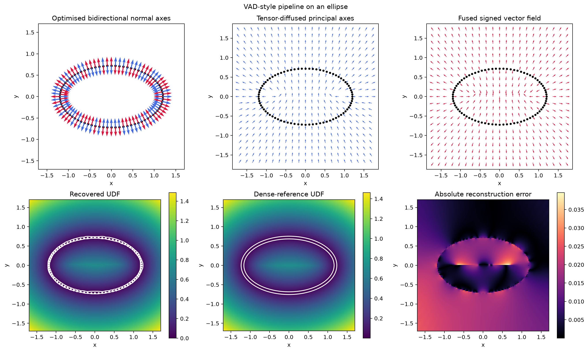
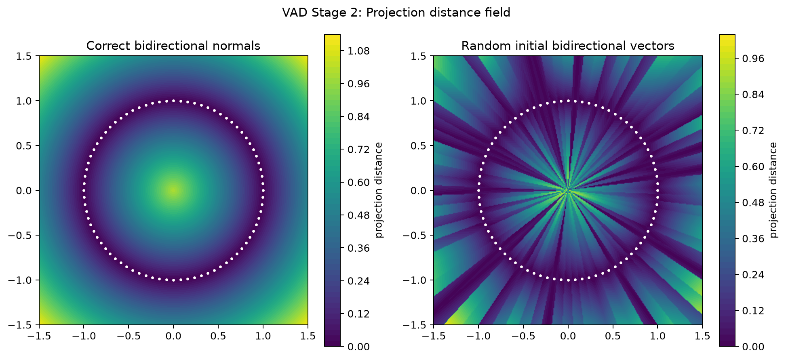
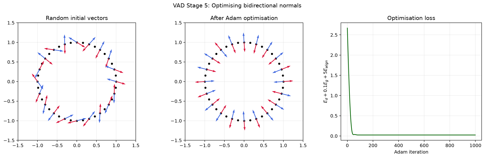
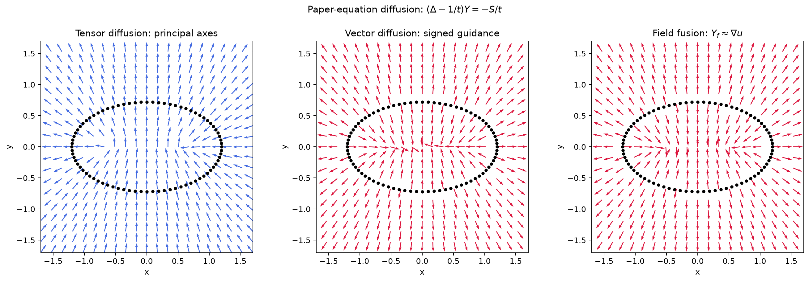
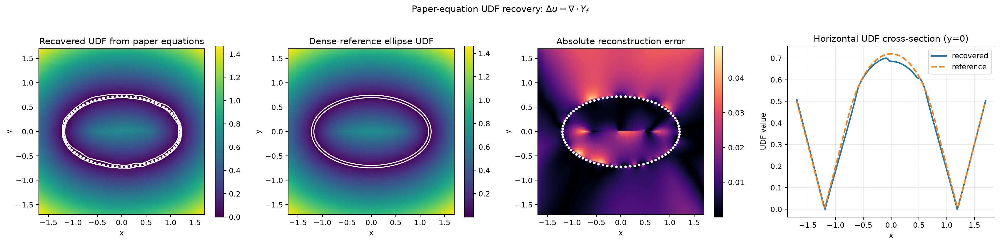
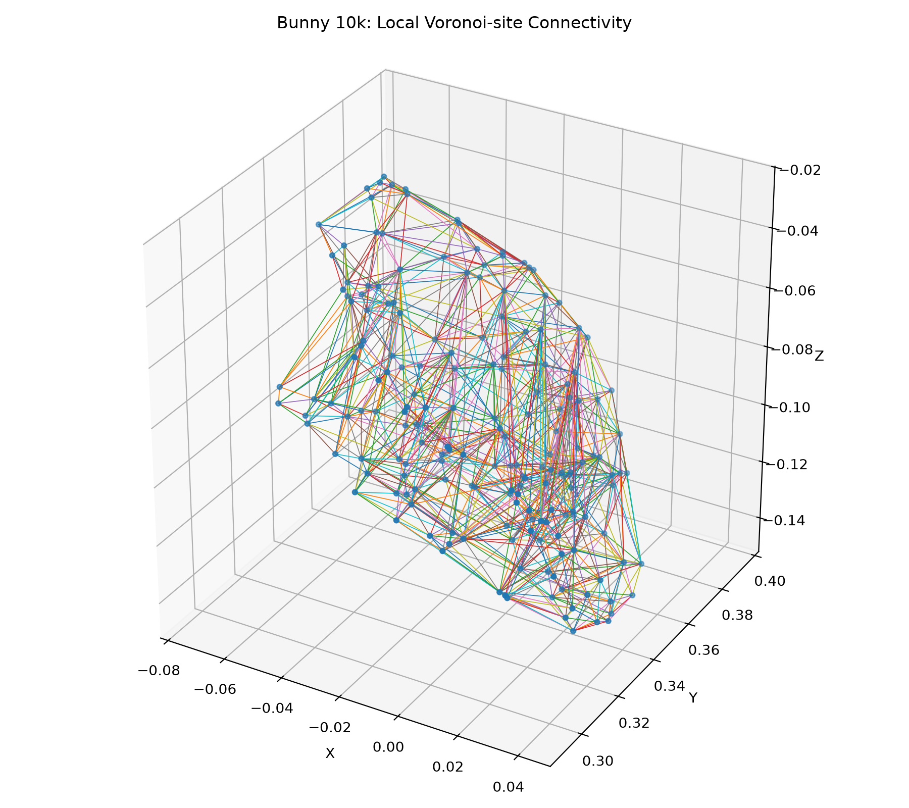
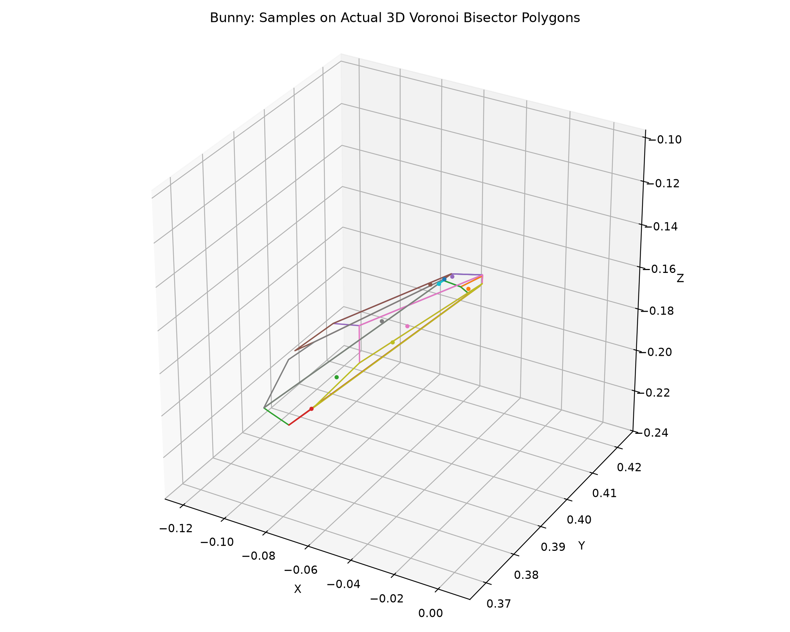

<div align="center">

# 🔷 Voronoi-Assisted UDF Reconstruction

### Reproducing and Exploring Geometry-Based UDF Reconstruction from Unoriented Point Clouds

<p>
  
  
  
  
  
</p>

<p>
  <b>Voronoi Diagram</b>
  &nbsp;→&nbsp;
  <b>Bi-directional Normals</b>
  &nbsp;→&nbsp;
  <b>Diffusion</b>
  &nbsp;→&nbsp;
  <b>Poisson Integration</b>
  &nbsp;→&nbsp;
  <b>Unsigned Distance Field</b>
</p>

<br>



<br>

<sub>
Independent reproduction and study of
<b>Voronoi-Assisted Optimization for Diffusing Unsigned Distance Fields from Unoriented Points (VAD)</b>.
</sub>

</div>

---

## Overview

Unsigned Distance Fields (UDFs) provide a flexible representation for surfaces without requiring an inside/outside sign convention, making them suitable for open surfaces and more general geometric structures.

VAD constructs a UDF from an **unoriented point cloud** through a geometry-based pipeline:

**Input Point Cloud  
→ Voronoi Diagram  
→ Projection Distance Field  
→ Voronoi Bisector Sampling  
→ Bi-directional Normal Optimization  
→ Tensor & Vector Diffusion  
→ Field Fusion  
→ Poisson Integration  
→ UDF**

The key idea is to exploit the connection between the projection distance field and the Voronoi diagram. Instead of enforcing consistency throughout the full spatial domain, the optimization focuses on discontinuities along Voronoi bisectors.

---

## Reproduction Pipeline

### 1. Projection Distance Field

A projection distance field is constructed from surface samples and their associated bi-directional vectors.

The early experiments use simple 2D geometries to visualize how different normal configurations affect the resulting field.

<p align="center">
  
</p>

---

### 2. Voronoi-Assisted Normal Optimization

The Voronoi diagram partitions the domain according to the nearest input sample.

Because the projection field is piecewise linear inside individual Voronoi cells, inconsistencies appear primarily across the cell bisectors. The implementation therefore samples these bisectors and evaluates consistency terms there.

Bi-directional vectors are optimized to reduce field-value and gradient discontinuities.

<p align="center">
  
</p>

---

### 3. VAD Pipeline on a 2D Ellipse

The ellipse experiment combines the earlier components into a more complete VAD-style pipeline.

<p align="center">
  
</p>

The corresponding implementation progressively validates:

- Voronoi construction
- projection-field behavior
- bisector energy
- bi-directional normal optimization
- diffusion
- field fusion
- UDF integration

---

### 4. Tensor and Vector Diffusion

After normal optimization, the aligned bi-directional normals must be propagated from sparse surface samples into the spatial domain.

The reproduction studies both **tensor diffusion** and **vector diffusion**, followed by field fusion to construct a smooth approximation of the UDF gradient.

<p align="center">
  
</p>

---

### 5. Poisson UDF Integration

The diffused vector field provides an approximation of the UDF gradient.

The scalar UDF is then recovered through numerical integration using a Poisson formulation.

<p align="center">
  
</p>

This stage connects the reconstructed gradient field back to a scalar unsigned distance representation.

---

## 3D Stanford Bunny Experiment

After validating individual components on synthetic 2D examples, the reproduction was extended to a 3D point cloud based on the Stanford Bunny.

The current repository includes:

- point-cloud normalization
- 3D Voronoi construction
- local Voronoi connectivity analysis
- bounded Voronoi bisector extraction
- area-weighted bisector surface sampling

### Voronoi Connectivity

<p align="center">
  
</p>

### Voronoi Bisector Sampling

<p align="center">
  
</p>

The sampled bisector surfaces provide the geometric domain required for subsequent normal optimization.

---

## Repository Structure

```text
.
├── data/
│   ├── bunny_points_10k.ply
│   ├── bunny_points_10k_normalized.npy
│   ├── bunny_points_10k_normalized.xyz
│   ├── bunny_voronoi_10k.npz
│   └── bunny_bisector_samples_200k.npz
│
├── outputs/
│   ├── 01_circle_udf.png
│   ├── ...
│   ├── 17_paper_udf_integration.png
│   ├── ...
│   └── 22_bunny_bisector_samples.png
│
├── src/
│   ├── 01_circle_udf.py
│   ├── 02_bidirectional_normals.py
│   ├── 03_projection_field.py
│   ├── ...
│   ├── 15_paper_voronoi_normal_optimisation.py
│   ├── 16_paper_screened_diffusion.py
│   ├── 17_paper_udf_integration.py
│   ├── ...
│   └── 22_bunny_bisector_sampling.py
│
├── .gitignore
└── README.md
